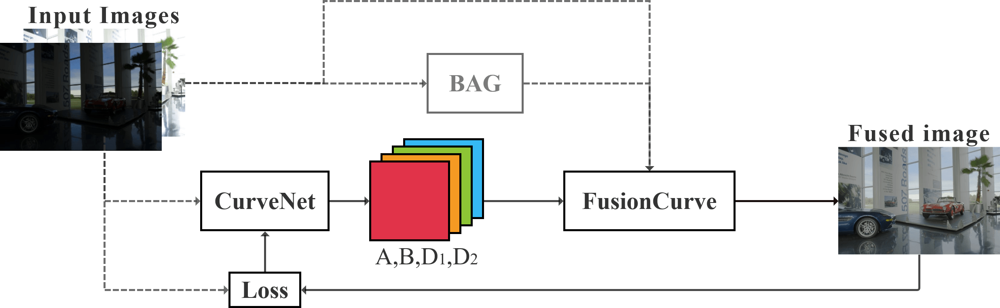
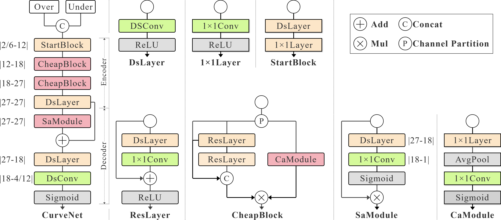
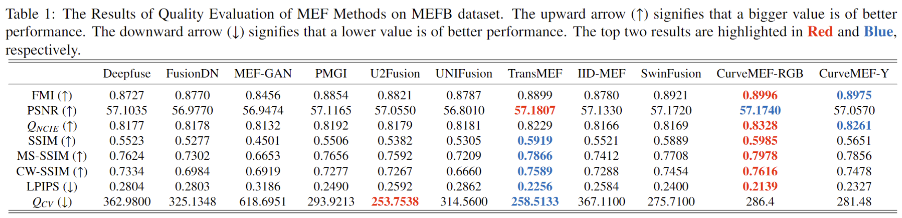
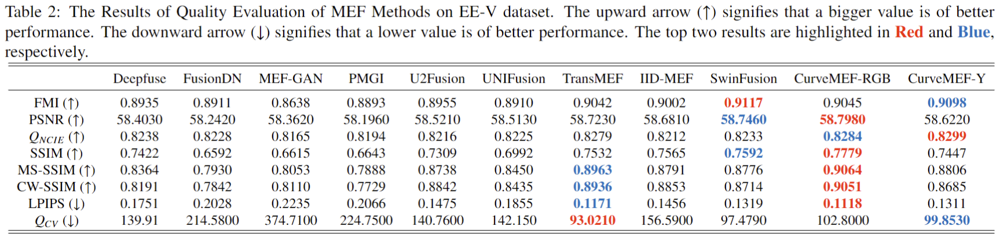
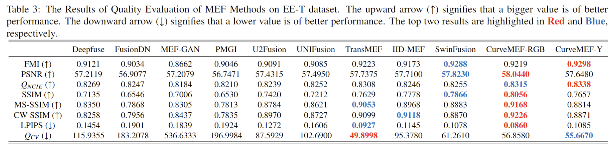
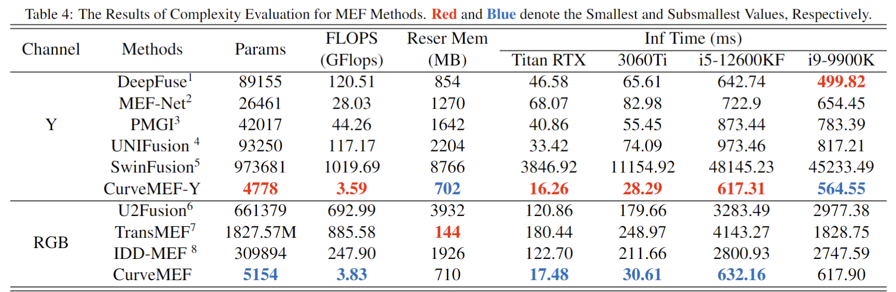

<div align="center">

# CurveMEF: Multi-Eposure Fusion via Curve Embedding Network
**Fast lightweight physical informed multi-exposure fusion model, Neurocomputing.**

</div>

## Introduction
This is official Pytorch implementation of [**CurveMEF: Multi-Exposure Fusion via Curve Embedding Network**](https://www.sciencedirect.com/science/article/pii/S0925231224006866).

### Framework



## ⚡️Quick Start

First, install requirements and setup CurveMEF following installation guide.
The pre-trained weight was trained by `config/curve/curvemef_rgb.yml` and `config/curve/curvemef_y.yml`.

* Inference

```bash
python inference.py -config CONFIG_PATH
```
****


## Install

### Requirements

* Linux or Windows
* CUDA >= 10.0
* Python >= 3.6
* Pytorch >= 1.9
* Lightning >= 1.9

### Step

1. Create a conda virtual environment and then activate it.

   ```shell script
    conda create -n curvemef python=3.9
    conda activate curvemef
   ```

2. Install Pytorch and Cuda

   ```shell script
   # For Cuda 11.3
   pip install torch==1.12.1+cu113 torchvision==0.13.1+cu113 torchaudio==0.12.1 --extra-index-url https://download.pytorch.org/whl/cu113
   # For Cuda 10.2
   pip install torch==1.12.1+cu102 torchvision==0.13.1+cu102 torchaudio==0.12.1 --extra-index-url https://download.pytorch.org/whl/cu102
   ```

3. Clone this repository

   ```shell script
   git clone https://github.com/PiratePai/CurveMEF.git
   cd curvemef
   ```

   

4. Install requirements

   ```shell script
   pip install lightning==2.0.4
   pip install torchmetrics==0.11.4
   pip install timm==0.9.2
   pip install termcolor==2.1.0
   pip install pytorch-lightning==1.9.0
   pip install matplotlib==3.7.1
   pip install opencv-contrib-python==4.8.0.74
   pip install termcolor==2.1.0
   pip install numpy==1.23.0
   pip install pyiqa==0.1.7
   ```

   OR

   ```shell script
   pip install -r requirements.txt
   ```

   


****


****

## Train

1. **Prepare dataset**
   
   You can download the [dataset](https://drive.google.com/drive/folders/1FcwjW4Up0xPdnU0ORzfmOWVdx40fu3Es?usp=sharing), 
   or custom your own dataset. Your dataset folder needs to contain two subfolders, high and low, with the same image names in both folders

    ```shell script
    [CustomDataset]/high/imgx
    [CustomDataset]/low/imgx
    ```

2. **Prepare config file**

    Copy and modify an example yml config file in config/curvemef.

    Change **pro_name** to your own project name.

    Change **save_dir** to where you want to save model.

    Change **model_name** to your own network.

    Change **train_path** and **test_path** to your own dataset. 

    Set **channel** to fit your dataset.

    Set num workers and batch size in **device** to fit your device.

    Set **total_epochs**, **optim_term** according to your dataset and batchsize.

3. **Start training**

   CurveMEF is using [Pytorch Lightning](https://github.com/PyTorchLightning/pytorch-lightning) for training.
   ```shell script
   python train.py -config config_path
   ```

4. **Visualize Train performance**

   - At the end of each `epoch` in the training phase, the model tests a pair of  multi-exposure images, and the test results are saved in the `Samples` folder.
   - If you want to replace the test pair with your own images, you can store `test1pngy.pt` and `test1png.pt` as your own image pairs.
   The tensor in `test1png.pt` is of the size as `[1, 6, H, W]`, and the tensor in `test1pngy.pt` is of the size as `[1, 2, H, W]`.
   - If you want to remove this feature, you need to comment the `self.test_tensor` code in `model_interface.py`.

   
5. **Visualize Logs**

    Logs are save in [`wandb`](https://wandb.ai/).

    In **pro_name** of the configuration file, set the project name of `wandb`.

    If you don't want to use it, just delete all the code that contains wandb in main.py and model_interface.py

5. **Convert RGB/YCbCr to YCbCr/RGB**

   Run **rgb2y.m** or **y2rgb.m**.

   Change **A_dir**, **B_dir**, **Fused_dir** and **save_dir** to your own path.

****
## :open_book: Benchmarks
### Performance Comparison




### Visual Comparison


### Complexity Comparison


- [1] https://github.com/SunnerLi/DeepFuse.pytorch
- [2] https://github.com/makedede/MEFNet
- [3] https://github.com/Beta-Hu/PMGI
- [4] https://github.com/1318133/LPUIF-A-Lightweight-Pixel-Level-Unified-Image-Fusion-Network
- [5] https://github.com/Linfeng-Tang/SwinFusion 
- [6] https://github.com/ytZhang99/U2Fusion-pytorch
- [7] https://github.com/miccaiif/TransMEF
- [8] https://github.com/HaoZhang1018/IID-MEF (We refer to this version for implement pytorch code of IID-MEF.)

****
## Citation

If you find this project useful in your research, please consider cite:

```BibTeX
@article{PENG2024127915,
title = {CurveMEF: Multi-exposure fusion via curve embedding network},
journal = {Neurocomputing},
volume = {596},
pages = {127915},
year = {2024},
issn = {0925-2312},
doi = {https://doi.org/10.1016/j.neucom.2024.127915},
url = {https://www.sciencedirect.com/science/article/pii/S0925231224006866},
author = {Pai Peng and Zhongliang Jing and Han Pan and Yang Liu and Buer Song},
keywords = {Multi-exposure fusion, Image fusion, Curve estimation, Physical informed neural network, Deep learning}
}
```

****

## :heart: Acknowledgement

Refer to [NanoDet](https://github.com/RangiLyu/nanodet), [Pytorch-Lightning](https://lightning.ai/docs/overview/getting-started) and [pytorch-lightning-template](https://github.com/miracleyoo/pytorch-lightning-template) for the overall code framework

The design of CurveNet is based on [GhostNetV3](https://github.com/huawei-noah/Efficient-AI-Backbones/blob/master/ghostnetv3_pytorch/ghostnetv3.py). 

We also thanks the following public repositories: [timm](https://github.com/rwightman/pytorch-image-models),  [torchmetrics](https://github.com/Lightning-AI/torchmetrics)

## :e-mail: Contact

If you have any questions, please email `pengpai@sjtu.edu.cn`

****

